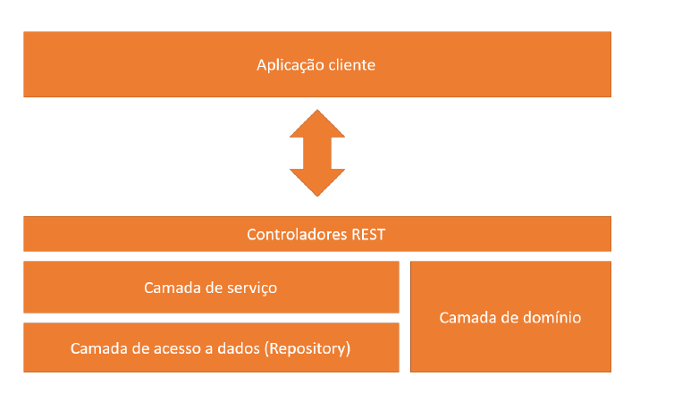

# Estudo de caso do diagrama UML

## Sobre o projeto
O sistema back-end permite o usuário realizar pedidos de produtos. A arquitetura está dividida nas camadas resource (controller), service e reposotory. 
Ao fazer um pedido, o sistema envia uma mensagem para o cliente através do email do Google. O cliente pode fazer o seu 
pagamento por boleto ou por cartão. Caso escolha por cartão, pode ser definido a quantidade de parcelas para realizar o
pagamento.

Quando o usuário esquecer sua senha, ele pode recuperá-la através de uma nova senha gerada de forma aleatória.
O sistema possui o refresh token para gerar um novo token com tempo de expiração renovado

O usuário tem suas permissões de acesso a partir de seu perfil: Cliente ou ADMIN.
O projeto possui profiles: test (teste), dev (desenvolvimento) e prod (produção). 
O profile define configurações do projeto ser executado em determinado ambiente.

## Tecnologias utilizadas
* Java
* Spring Boot
* Spring Rest
* Spring Data JPA
* Spring Security/ JWT
* Banco de Dados H2
* MySQL
* SMTP do Google

## Padrões utilizados no projeto
* Rest
* DTO
* Strategy

## Diagrama UML

## Estrutura das camadas do sistema

## Autor
Raul Santos Gonçalves

[https://www.linkedin.com/in/raul-gonçalves-641310190/](https://www.linkedin.com/in/raul-gonçalves-641310190/)
